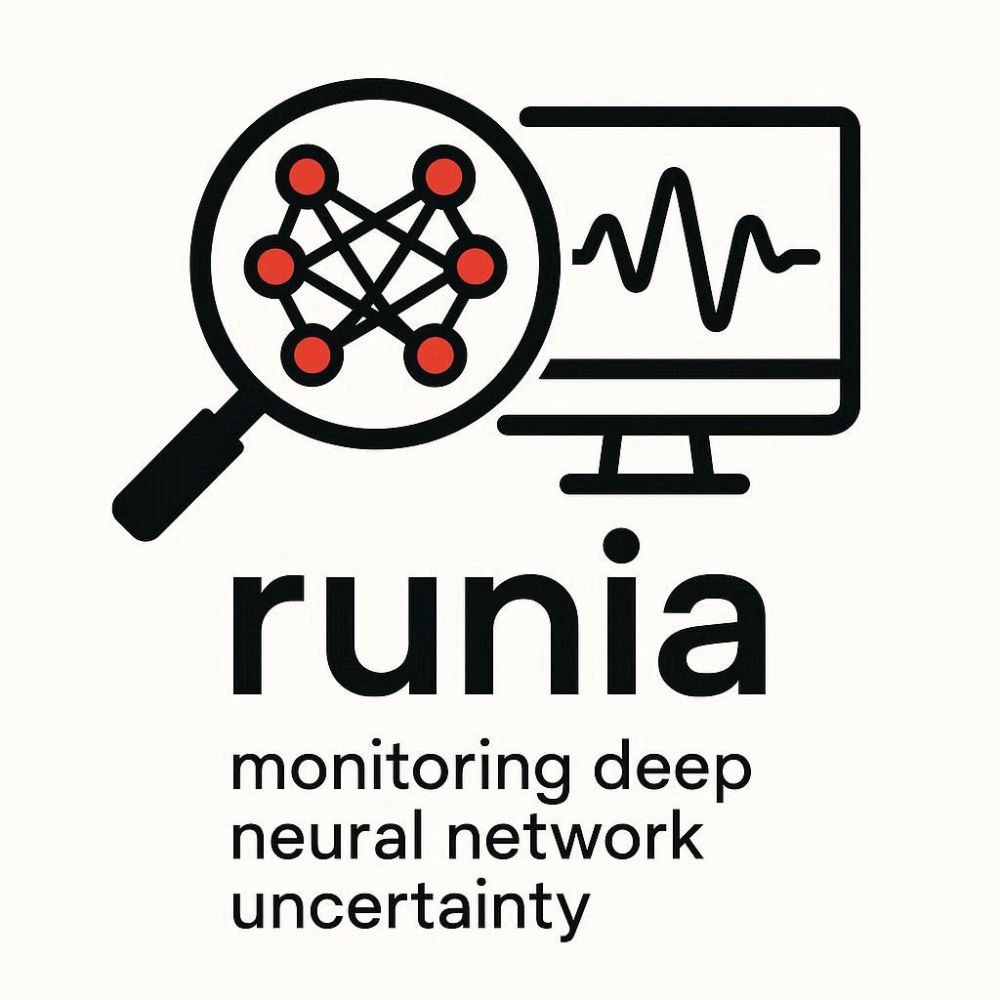

<div align="center">
    
    <h1 style="font-size: large; font-weight: bold;">Runtime Uncertainty estimation for AI models</h1>
</div>

<div align="center">
    <a href="https://www.python.org/downloads/release/python-390/">
        
    </a>
    <a href="https://github.com/psf/black">
        
    </a>
    
</div>
<br>

---

# Overview

**RunIA** is an open-source Python library for uncertainty estimation and Out-of-Distribution (OoD) detection in AI models. It provides comprehensive tools for evaluating and deploying uncertainty estimation methods across computer vision tasks (image classification, object detection, semantic segmentation) and natural language processing (LLM hallucination detection).

## Key Features

- **Latent Space Uncertainty Estimation**: LaRED (Latent Representations Density) and LaREM (Latent Representations Mahalanobis) methods for OoD detection
- **Monte Carlo Dropout (MCD)**: Epistemic uncertainty estimation through MC sampling
- **Multiple Baseline Methods**: Support for 15+ baseline OoD detection methods (MSP, Energy, Mahalanobis, kNN, ViM, DDU, DICE, ReAct, and more)
- **LLM Uncertainty**: Hallucination detection with methods like semantic entropy, RAUQ, perplexity, and eigen scores
- **Feature Extraction**: Image-level and object-level feature extraction for various architectures
- **Flexible Inference**: Production-ready inference modules for real-time OoD detection
- **Comprehensive Evaluation**: Built-in metrics (AUROC, AUPR, FPR@95) and visualization tools

## Table of Contents

- [Installation](#installation)
- [Quick Start](#quick-start)
- [Usage Examples](#usage-examples)
  - [Computer Vision: OoD Detection](#computer-vision-ood-detection)
  - [LLM Uncertainty Estimation](#llm-uncertainty-estimation)
- [Supported Tasks and Architectures](#supported-tasks-and-architectures)
- [API Overview](#api-overview)
- [Hardware Requirements](#hardware-requirements)
- [References](#references)

---

## Installation

### Prerequisites

- Python 3.9 or higher
- CUDA-capable GPU (recommended for computer vision tasks)

### Using pip

```bash
# Clone the repository
git clone <repository-url>
cd runia

# Create a virtual environment (recommended)
python -m venv runia_env
source runia_env/bin/activate  # On Windows: runia_env\Scripts\activate

# Install dependencies
pip install -r requirements.txt

# Install the package
pip install .
```

### Using conda

```bash
# Create a conda environment
conda create -n runia_env python=3.9
conda activate runia_env

# Install dependencies and package
pip install -r requirements.txt
pip install .
```

### Using uv
See [uv documentation](https://docs.astral.sh/uv/) for installation instructions. Dependencies are installed on first run. 
Therefore, you can run any script with:

```bash
# Directly run any script (dependencies are installed on first run)
uv run your_script.py
```
---

## Quick Start

### Computer Vision OoD Detection with Latent Space Methods LaREx

```python
import torch
from runia.evaluation import Hook, get_latent_representation_mcd_samples, get_dl_h_z
from runia.inference import LaRExInference, MCSamplerModule, LaREMPostprocessor
from runia import apply_pca_ds_split

# Setup model with dropout/dropblock layer
model = YourModel()
hooked_layer = Hook(model.dropout_layer)
model.eval()

# Extract MC samples and compute entropy
latent_samples = get_latent_representation_mcd_samples(
    model, dataloader, n_samples=16, hooked_layer
)
_, entropy_samples = get_dl_h_z(latent_samples, mcd_samples_nro=16)

# Setup OoD detector
pca_train, pca_transform = apply_pca_ds_split(entropy_samples, nro_components=256)
detector = LaREMPostprocessor()
detector.setup(pca_train)

# Inference on new images
inference_module = LaRExInference(
    dnn_model=model,
    detector=detector,
    mcd_sampler=MCSamplerModule,
    pca_transform=pca_transform,
    mcd_samples_nro=16,
    layer_type="Conv"
)

prediction, confidence_score = inference_module.get_score(test_image, layer_hook=hooked_layer)
```

### LLM Uncertainty Estimation (White-box methods)

```python
from transformers import AutoModelForCausalLM, AutoTokenizer, GenerationConfig
from runia.llm_uncertainty import compute_uncertainties

# Load model and tokenizer
tokenizer = AutoTokenizer.from_pretrained("meta-llama/Llama-3.1-8B-Instruct")
model = AutoModelForCausalLM.from_pretrained("meta-llama/Llama-3.1-8B-Instruct")

gen_config = GenerationConfig(max_new_tokens=50, do_sample=True, temperature=1.0)

# Define uncertainty methods
uncertainty_requests = [
    {"method_name": "semantic_entropy"},
    {"method_name": "perplexity"},
    {"method_name": "eigen_score"},
    {"method_name": "RAUQ", "token_aggregation": "original", "head_aggregation": "mean_heads"}
]

# Compute uncertainties
generated_text, scores = compute_uncertainties(
    model, tokenizer, "Your prompt here",
    uncertainty_requests, gen_config, num_samples=10
)
```

---

## Supported Tasks and Architectures

### Computer Vision

| Task | Datasets (In-Dist) | Datasets (OoD) | Architectures |
|------|-------------------|----------------|---------------|
| **Image Classification** | CIFAR10 | FMNIST, SVHN, Places365, Textures, iSUN, LSUN | ResNet-18, ResNet-18 + Spectral Norm |
| **Object Detection** | BDD100k, Pascal VOC | COCO, OpenImages | Faster RCNN, YOLOv8, RT-DETR, Deformable DETR, OWLv2 |
| **Semantic Segmentation** | Woodscape, Cityscapes | Woodscape-anomalies, Cityscapes-anomalies | DeepLabv3+, U-Net |

### Natural Language Processing

| Task | Datasets (In-Dist) | Datasets (OoD) | Architectures |
|------|-------------------|----------------|---------------|
| **Hallucination Detection** | SQuADv2 | TriviaQA, Natural Questions, HotpotQA | Llama-3.1, DistilBERT-base |

**Note**: For epistemic uncertainty estimation in computer vision tasks, models should include dropout or DropBlock2D layers to enable Monte Carlo Dropout sampling.
However, RunIA can be used with any architecture by hooking any latent layer and extracting features for OoD detection with LaRED/LaREM, without the need for MC sampling. 
In this case, the latent space methods will be applied on the extracted features instead of the entropy from MC samples.

---

## Usage Examples

### Computer Vision: OoD Detection in Object Detection

#### 1. Evaluation Pipeline

Evaluate OOD detection methods on In-Distribution (InD) vs Out-of-Distribution (OoD) datasets in Object Detection.
The library is focused on latent space methods but can compute 10+ other methods (MSP, Energy, Mahalanobis, kNN, ViM, DDU, DICE, ReAct, etc.):

```python
import torch
from omegaconf import OmegaConf
from runia.feature_extraction import Hook, BoxFeaturesExtractor, get_aggregated_data_dict, associate_precalculated_baselines_with_raw_predictions
from runia.evaluation import log_evaluate_larex
from runia.baselines import calculate_all_baselines, remove_latent_features, get_baselines_thresholds

# Setup
BASELINES_NAMES = ["msp", "gen", "energy", "mdist", "knn", "ddu"]
LATENT_SPACE_POSTPROCESSORS = ["MD"]
cfg = OmegaConf.create({"ood_datasets": ['ood_dataset_name']})
device = torch.device('cuda' if torch.cuda.is_available() else 'cpu')

# Load model and hook dropout/dropblock layer
model = YourModel.load_from_checkpoint("model.pt")
hooked_layers = [Hook(model.my_latent_layer)]
model.to(device).eval()

# Instantiate BoxFeaturesExtractor for object detection architectures (e.g., Faster RCNN, YOLOv8, RT-DETR, Deformable DETR, OWLv2)
samples_extractor = BoxFeaturesExtractor(
    model=model,
    hooked_layers=hooked_layers,
    device=device,
    roi_output_sizes=[16],
    roi_sampling_ratio=-1,
    return_raw_predictions=False,
    return_stds=False,
    hook_layer_output=True,
    architecture="rcnn"
)

# Extract latent samples and features for InD and OoD datasets
ind_data_dict = {
  "train": samples_extractor.get_ls_samples(ind_train_data_loader, predict_conf=0.5),
  "valid": samples_extractor.get_ls_samples(ind_val_data_loader, predict_conf=0.5)
}
aggregated_ind_data_dict = dict()
# Track images with no objects found from varying the confidence of predictions
ind_no_obj = dict()
non_empty_preds_ind_im_ids = dict()

ood_data_dict = {"ood_dataset_name": samples_extractor.get_ls_samples(ood_data_loader, predict_conf=0.5)} 
aggregated_ood_data_dict = dict()
non_empty_preds_ood_im_ids = dict()
ood_no_obj = dict()

# Preprocess ID datasets and aggregate data in the format required for evaluation (one entry per image with aggregated features from all predicted boxes)
for split in ind_data_dict:    
    aggregated_ind_data_dict, ind_no_obj, non_empty_preds_ind_im_ids = get_aggregated_data_dict(
        data_dict=ind_data_dict,
        dataset_name=split,
        aggregated_data_dict=aggregated_ind_data_dict,
        no_obj_dict=ind_no_obj,
        non_empty_predictions_ids=non_empty_preds_ind_im_ids,
        probs_as_logits=False
    )

# Preprocess OOD datasets and aggregate data in the format required for evaluation
for ood_dataset_name in cfg.ood_datasets:
    aggregated_ood_data_dict, ood_no_obj, non_empty_preds_ood_im_ids = get_aggregated_data_dict(
        data_dict=ood_data_dict,
        dataset_name=ood_dataset_name,
        aggregated_data_dict=aggregated_ood_data_dict,
        no_obj_dict=ood_no_obj,
        non_empty_predictions_ids=non_empty_preds_ood_im_ids,
        probs_as_logits=False
    )
    
aggregated_ind_data_dict, aggregated_ood_data_dict, ood_baselines_scores_dict = calculate_all_baselines(
    baselines_names=BASELINES_NAMES,
    ind_data_dict=aggregated_ind_data_dict,
    ood_data_dict=aggregated_ood_data_dict,
    fc_params=None,
    cfg=cfg,
    num_classes=10 if cfg.ind_dataset == "bdd" else 20
)

aggregated_ind_data_dict, aggregated_ood_data_dict = remove_latent_features(
    id_data=aggregated_ind_data_dict,
    ood_data=aggregated_ood_data_dict,
    ood_names=cfg.ood_datasets
)
baselines_thresholds = get_baselines_thresholds(
    baselines_names=BASELINES_NAMES,
    baselines_scores_dict=aggregated_ind_data_dict,
    z_score_percentile=cfg.z_score_thresholds
)

# Associate calculated baselines scores with raw predictions dicts
# OOD
for ood_dataset_name in cfg.ood_datasets:
    ood_data_dict[ood_dataset_name] = associate_precalculated_baselines_with_raw_predictions(
        data_dict=ood_data_dict[ood_dataset_name],
        dataset_name=ood_dataset_name,
        ood_baselines_dict=ood_baselines_scores_dict,
        baselines_names=BASELINES_NAMES,
        non_empty_ids=non_empty_preds_ood_im_ids[ood_dataset_name],
        is_ood=True
    )
# InD
ind_data_dict["valid"] = associate_precalculated_baselines_with_raw_predictions(
    data_dict=ind_data_dict["valid"],
    dataset_name="valid",
    ood_baselines_dict=aggregated_ind_data_dict,
    baselines_names=BASELINES_NAMES,
    non_empty_ids=non_empty_preds_ind_im_ids["valid"],
    is_ood=False
)
    
metrics_df, best_postprocessors_dict, postprocessor_thresholds, aggregated_ood_data_dict = log_evaluate_larex(
    cfg=cfg,
    baselines_names=BASELINES_NAMES,
    ind_data_dict=aggregated_ind_data_dict,
    ood_data_dict=aggregated_ood_data_dict,
    ood_baselines_scores=ood_baselines_scores_dict,
    mlflow_run_name="my_run_name",
    mlflow_logging=False,
    visualize_score=LATENT_SPACE_POSTPROCESSORS[0],
    postprocessors=LATENT_SPACE_POSTPROCESSORS,
)
print(metrics_df)
```

#### 2. Inference Pipeline

Deploy OoD detection in production with the inference module, using the best postprocessor from evaluation (e.g., LaREM or LaRED) or any other method from the evaluation pipeline by setting the appropriate confidence threshold for predictions to be considered in inference (can be tuned based on evaluation results):

```python
import torch
from runia.feature_extraction import get_aggregated_data_dict
from runia.inference import postprocessors_dict, ObjectLevelInference, postprocessor_input_dict

METHOD = "energy"  # or "MD" for LaREM, "KDE" for LaRED, or any other method from the evaluation pipeline
LATENT_SPACE_METHOD=False  # Set to True if using latent space postprocessors (LaREM or LaRED), False for other methods
INFERENCE_THRESHOLD = 0.5  # Set the confidence threshold for predictions to be considered in inference (can be tuned based on evaluation results)
device = torch.device('cuda' if torch.cuda.is_available() else 'cpu')

# Load pre-calculated latent space activations, features or logits for InD datasets
# Extracted using the BoxFeaturesExtractor or any other method and saved in the required format for evaluation and inference
# InD
ind_data_splits = ["train", "valid"]
ind_data_dict = dict()
aggregated_ind_data_dict = dict()
non_empty_preds_ind_im_ids = dict()
# Track images with no objects found from varying the confidence of predictions
ind_no_obj = dict()
for split in ind_data_splits:
    ind_file_name = f"my/file/name_{split}.pt"
    # Load InD latent space activations
    ind_data_dict[f"{split}"] = torch.load(ind_file_name, map_location=device)
    aggregated_ind_data_dict, ind_no_obj, non_empty_preds_ind_im_ids = get_aggregated_data_dict(
        data_dict=ind_data_dict,
        dataset_name=split,
        aggregated_data_dict=aggregated_ind_data_dict,
        no_obj_dict=ind_no_obj,
        non_empty_predictions_ids=non_empty_preds_ind_im_ids,
        probs_as_logits=False
    )

postprocessor = postprocessors_dict[METHOD](method_name=METHOD, flip_sign=False)
postprocessor.setup(ind_train_data=aggregated_ind_data_dict["valid logits"])

# Load model
model = YourModel.load_from_checkpoint("model.pt")
hooked_layers = []  # Specify the layers to hook for feature extraction if using latent space methods (e.g., LaREM or LaRED), otherwise can be left empty for other methods that do not require feature extraction

inference_module = ObjectLevelInference(
    model=model,
    postprocessor=postprocessor,
    architecture="RTDETR",  # or "rcnn", "yolo", "deformable_detr", "owlv2"
    latent_space_method=LATENT_SPACE_METHOD,
    postprocessor_input=postprocessor_input_dict[METHOD] if not LATENT_SPACE_METHOD else ["latent_space_means"],
    hooked_layers=hooked_layers,
    roi_output_sizes=[16],
)

with torch.no_grad():
    # Perform inference on new images
    for idx, input_im in enumerate(my_data_loader):
        predictions, scores = inference_module.get_score(input_im, predict_conf=INFERENCE_THRESHOLD)
```

#### 3. Using Baseline Methods

RunIA supports 15+ baseline OoD detection methods:

```python
from runia.baselines import compute_baseline_from_model

# Available methods: 'msp', 'energy', 'mdist', 'knn', 'vim', 'ddu', 'dice', 'react', etc.
baseline_scores = compute_baseline_from_model(
    model=model,
    dataloader=test_loader,
    method_name='energy',  # Energy-based OoD detection
    device='cuda'
)
```

### LLM Uncertainty Estimation

Detect hallucinations and measure uncertainty in LLM outputs:

```python
from transformers import AutoModelForCausalLM, AutoTokenizer, GenerationConfig
from runia.llm_uncertainty import compute_uncertainties

# Load model
tokenizer = AutoTokenizer.from_pretrained("meta-llama/Llama-3.1-8B-Instruct")
model = AutoModelForCausalLM.from_pretrained("meta-llama/Llama-3.1-8B-Instruct")

gen_config = GenerationConfig(
    max_new_tokens=50,
    do_sample=True,
    top_p=0.9,
    temperature=1.0
)

# Define uncertainty methods
uncertainty_methods = [
    {"method_name": "semantic_entropy"},      # Semantic uncertainty
    {"method_name": "eigen_score"},            # Eigenvalue-based score
    {"method_name": "perplexity"},             # Model perplexity
    {"method_name": "normalized_entropy"},     # Normalized entropy
    {"method_name": "generation_entropy"},     # Generation-level entropy
    {
        "method_name": "RAUQ",                 # Attention-based uncertainty
        "token_aggregation": "original",
        "head_aggregation": "mean_heads",
        "alphas": [0.2, 0.4, 0.6],
        "ablation": True
    }
]

# Compute uncertainties
text, scores = compute_uncertainties(
    model,
    tokenizer,
    prompt="What is the capital of France?",
    uncertainty_requests=uncertainty_methods,
    gen_config=gen_config,
    num_samples=10
)

print(f"Generated: {text}")
print(f"Uncertainty Scores: {scores}")
```

---

## API Overview

### Core Modules

| Module | Description |
|--------|-------------|
| `runia.evaluation` | MC sampling, entropy computation, OoD evaluation metrics |
| `runia.inference` | Production-ready inference with LaRED/LaREM postprocessors |
| `runia.baselines` | 15+ baseline OoD detection methods (MSP, Energy, Mahalanobis, kNN, ViM, DDU, DICE, ReAct, etc.) |
| `runia.feature_extraction` | Image-level and object-level feature extraction |
| `runia.llm_uncertainty` | LLM uncertainty and hallucination detection methods |
| `runia.dimensionality_reduction` | PCA and other dimensionality reduction utilities |

### Key Classes and Functions

**Evaluation:**
- `Hook`: Capture layer outputs during forward pass
- `get_latent_representation_mcd_samples()`: Extract MC dropout samples
- `get_dl_h_z()`: Compute entropy from MC samples
- `log_evaluate_lared_larem()`: Evaluate LaRED/LaREM with metrics

**Inference:**
- `LaRExInference`: Main inference module for OoD detection
- `LaREMPostprocessor`: Mahalanobis distance-based detector (recommended)
- `LaREDPostprocessor`: KDE-based detector
- `MCSamplerModule`: Monte Carlo sampling module

**LLM Uncertainty:**
- `compute_uncertainties()`: Compute multiple uncertainty scores for LLM outputs

---

## Hardware Requirements

- **CPU**: Supported but slow for computer vision tasks
- **GPU**: Required for efficient inference on object detection and segmentation
- **Memory**: Varies by model size (8GB+ GPU memory recommended)

---

## References

### Publications

- [Latent representation entropy density for distribution shift detection](https://hal.science/hal-04674980v1/file/417_latent_representation_entropy_.pdf)


---

## Contributing

Contributions are welcome! Please feel free to submit issues or pull requests.

## License

See [LICENSE.txt](LICENSE.txt) for details.

## Authors

- **Fabio Arnez** - fabio.arnez@cea.fr
- **Daniel Montoya** - daniel-alfonso.montoyavasquez@cea.fr

---

## Acknowledgments

This work was developed as part of the Confiance.ai program, focusing on trustworthy AI systems with emphasis on uncertainty estimation and out-of-distribution detection.